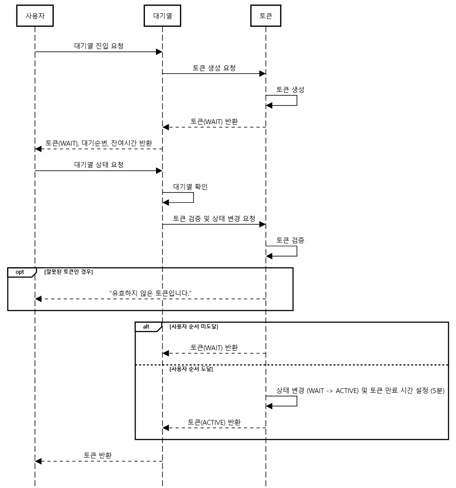
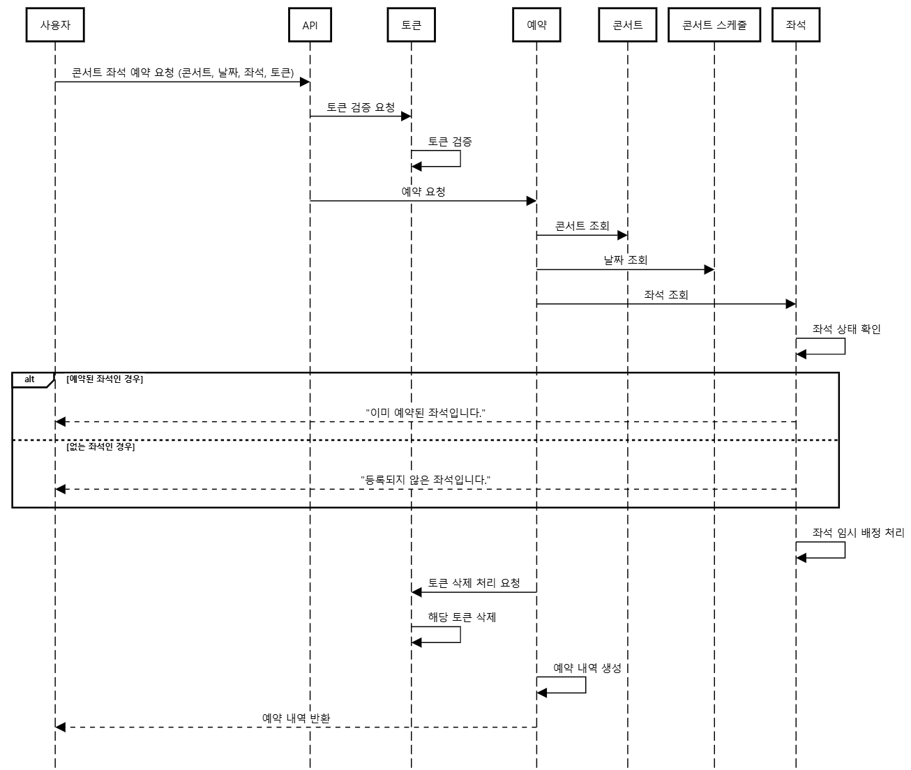
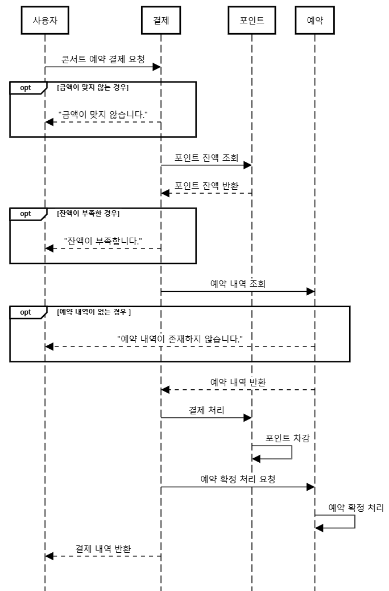
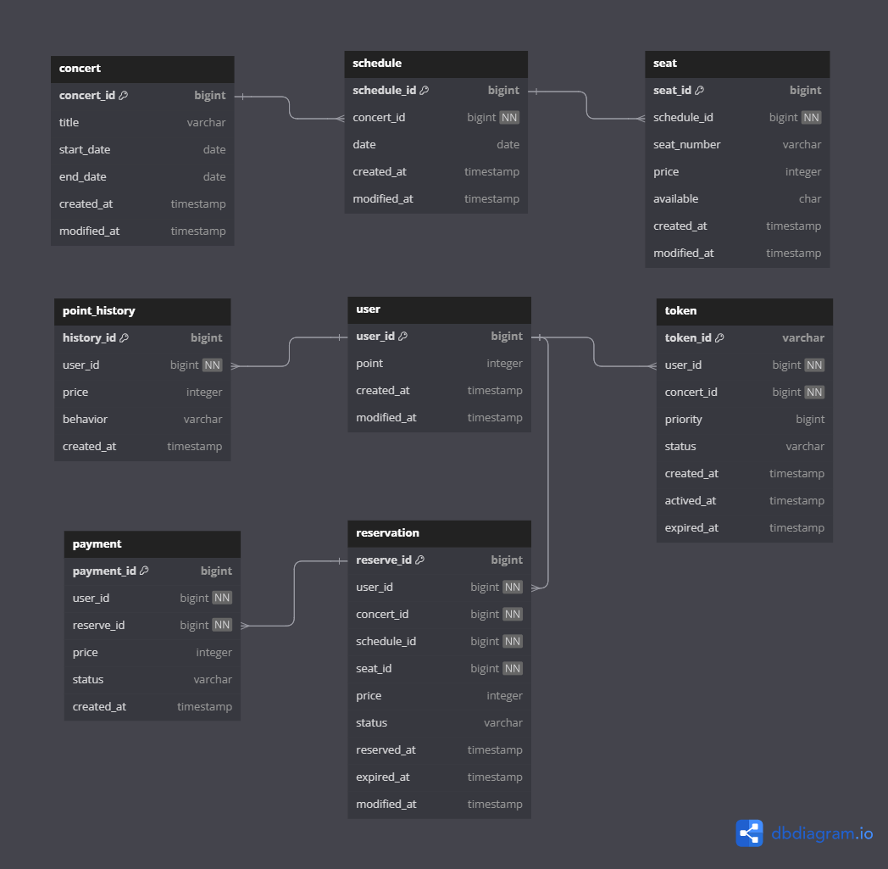

# 콘서트 예약 서비스

---

## Milestone
**12/28 ~ 1/3**
- 시나리오 선정
- 프로젝트 milestone 작성
- 다이어그램 작성
- ERD 설계
- API Specs 작성
- Mock API 작성

**1/4 ~ 1/10**
- 유저 토큰 발급 API
- polling 또는 WebSocket을 통한 대기열 상태 확인 기능
- 예약 가능 날짜/좌석 조회 API
- 좌석 예약 API
- 잔액 충전/조회 API
- 결제 API

**1/11 ~ 1/17**
- 기능 고도화
- 코드 리팩토링

## 프로젝트 요구 사항
- 유저 토큰 발급
- 예약 가능 날짜 / 좌석 조회
- 좌석 예약
- 잔액 충전 / 조회
- 결제

## 시퀀스 다이어그램

<b>유저 대기열 토큰 발급</b>

<b>예약 가능 날짜/좌석 조회</b>

<b>좌석 예약</b>

<b>잔액 충전 / 조회</b>

<b>결제</b>

## ERD

