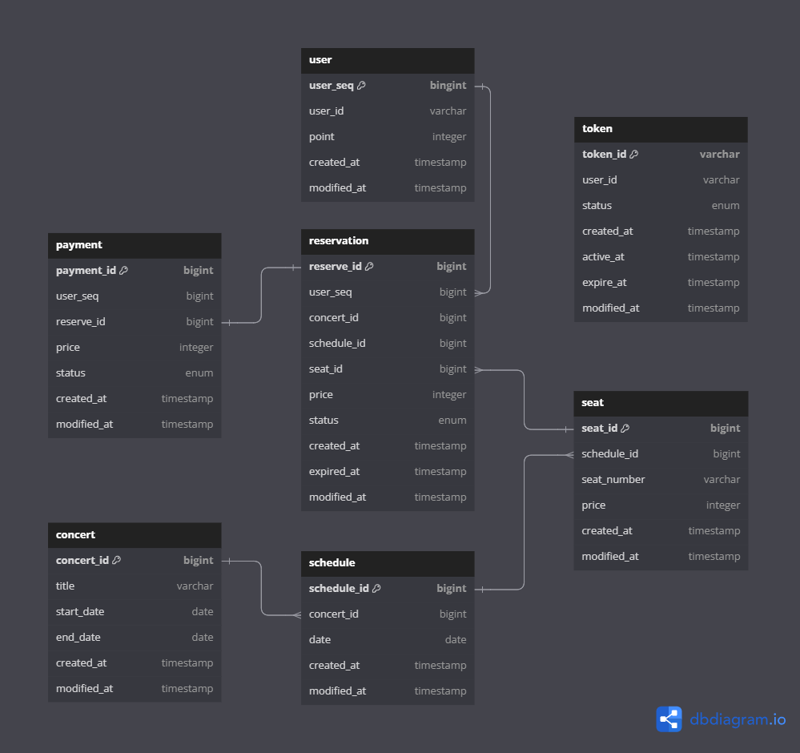

# 콘서트 예약 서비스

---

## Milestone
**12/28 ~ 1/3**
- 시나리오 선정
- 프로젝트 milestone 작성
- 다이어그램 작성
- ERD 설계
- API Specs 작성
- Mock API 작성

**1/4 ~ 1/10**
- 유저 토큰 발급 API
- 대기열 상태 확인 기능
- 예약 가능 날짜/좌석 조회 API
- 좌석 예약 API
- 잔액 충전/조회 API
- 결제 API

**1/11 ~ 1/17**
- 기능 고도화
- 코드 리팩토링

## 프로젝트 요구 사항
- 유저 토큰 발급
- 예약 가능 날짜 / 좌석 조회
- 좌석 예약
- 잔액 충전 / 조회
- 결제

## 시퀀스 다이어그램

<details>
<summary><b>유저 대기열 토큰 발급</b></summary>


</details>

<details>
<summary><b>예약 가능 날짜/좌석 조회</b></summary>


</details>

<details>
<summary><b>좌석 예약</b></summary>


</details>

<details>
<summary><b>잔액 충전 / 조회</b></summary>


</details>

<details>
<summary><b>결제</b></summary>


</details>

## ERD


## [API Specs](docs/api-spec.md)

http://localhost:8080/swagger-ui/index.html


<details>
<summary><b>콘서트 목록/상세 조회</b></summary>

### `GET /concerts`

### **Endpoint**
```http request
GET /concerts
HOST: localhost:8080
```
### **200 OK**
```json
[
  {
    "id": 1,
    "title": "콘서트명1",
    "startDate": "2024-12-31",
    "endDate": "2025-01-01"
  },
  {
    "id": 2,
    "title": "콘서트명2",
    "startDate": "2025-01-01",
    "endDate": "2025-01-02"
  }
]
```

### `GET /concerts/:concertId`

### **Endpoint**
```http request
GET /concerts/1
HOST: localhost:8080
```

### **200 OK**
```json
{
  "id": 1,
  "title": "콘서트명1",
  "startDate": "2024-12-31",
  "endDate": "2025-01-01"
  
}
```
### **404 Not Found**
```json
GET /concerts/99
HOST: localhost:8080
{
  "status": "NOT_FOUND",
  "message": "등록되지 않은 콘서트입니다."
}
```
</details>

<details>
<summary><b>대기열 토큰 발급</b></summary>

### `POST /queues`

### **Endpoint**
```http request
POST /queues
Content-Type: application/json
```

### **Request**
```json
{
  "userId": "test1234"
}
```

### **201 Created**
**대기 상태**
```json
{
  "tokenId": "15e859ae-9bf2-4f08-ae68-465e9dcd54bf",
  "userId": "test1234",
  "priority": 3,
  "status": "WAIT",
  "createdAt": "2024-01-01T00:05:33Z",
  "activeAt": null,
  "expireAt": null
}
```
**활성화 상태**
```json
{
  "tokenId": "15e859ae-9bf2-4f08-ae68-465e9dcd54bf",
  "userId": "test1234",
  "priority": 0,
  "status": "WAIT",
  "createdAt": "2024-01-01T00:05:33Z",
  "activeAt": "2024-01-01T00:08:33Z",
  "expireAt": "2024-01-01T00:13:33Z"
}
```
</details>

<details>
<summary><b>대기열 상태 조회</b></summary>

### `GET /queues/:userId`

### **Endpoint**
```http request
GET /queues/test1234
Authorization: Bearer {tokenId}
```
### **200 OK**
대기 상태
```json
{
  "tokenId": "15e859ae-9bf2-4f08-ae68-465e9dcd54bf",
  "userId": "test1234",
  "priority": 1,
  "status": "WAIT",
  "createdAt": "2024-01-01T00:05:33Z",
  "activeAt": null,
  "expireAt": null
}
```
사용자 순서 도달 시 토큰 상태 활성화 및 만료 시간을 5분으로 설정
```json
{
  "tokenId": "15e859ae-9bf2-4f08-ae68-465e9dcd54bf",
  "userId": "test1234",
  "priority": 0,
  "status": "ACTIVE",
  "createdAt": "2024-01-01T00:05:33Z",
  "activeAt": "2024-01-01T00:08:33Z",
  "expireAt": "2024-01-01T00:13:33Z"
}
```
### **401 Unauthorized**
Authorization 정보가 없는 경우
```json
{
  "message": "토큰 정보가 누락되었습니다."
}
```
### **403 Forbidden**
잘못된 토큰인 경우
```json
{
  "message": "잘못된 토큰입니다."
}
```
</details>

<details>
<summary><b>예약 날짜 조회</b></summary>


### `GET /concerts/:concertId/schedules`

### **Endpoint**
```http request
GET /concerts/1/schedules
HOST: localhost:8080
Authorization: Bearer {tokenId}
```

### **200 OK**
```json
{
  "concertId": 1,
  "schedules": [
    {
      "scheduleId": 1,
      "date": "2024-12-31"
    },
    {
      "scheduleId": 2,
      "date": "2025-01-01"
    }
  ]
}
```
</details>

<details>
<summary><b>좌석 조회</b></summary>

### `GET /concerts/schedules/:scheduleId/seats`

### **Endpoint**
```http request
GET /concerts/schedules/1/seats HTTP/1.1
HOST: localhost:8080
Authorization: Bearer {tokenId}
```

### **200 OK**
```json
{
  "scheduleId": 1,
  "seats": [
    {
      "seatId": 1,
      "seatNumber": "A1",
      "price": 75000
    },
    {
      "seatId": 2,
      "seatNumber": "B1",
      "price": 60000
    }
  ]
}
```
</details>

<details>
<summary><b>좌석 예약</b></summary>

### `POST /reservations`

### **Endpoint**
```http request
POST /reservations
Content-Type: application/json
Authorization: Bearer {tokenId}
```

### **Request**
```json
{
  "userId": "test1234",
  "concertId": 1,
  "scheduleId": 1,
  "seatId": 1
}
```
**201 Created**

좌석 예약 성공 시 대기열 토큰 삭제 -> 좌석 임시 배정 시간을 5분으로 설정
```json
{
  "reserveId": 1,
  "schedule": "2025-01-01",
  "seatNumber": "A1",
  "concert": {
    "concertId": 1,
    "title": "콘서트명1",
    "startAt": "2024-12-31",
    "endAt": "2025-01-01"
  },
  "price": 75000,
  "status": "TEMP",
  "createdAt": "2025-01-01T00:15:33Z",
  "expiredAt": "2024-01-01T00:20:33Z"
}
```
</details>

<details>
<summary><b>잔액 충전 및 조회</b></summary>


### 충전 - `PATCH /points`

### **Endpoint**
```http request
PATCH /points
Content-Type: application/json
```

### **Request**
```json
{
  "userId": "test1234",
  "amount": 100000
}
```

### 200 OK
```json
{
  "userId": "test1234",
  "point": 100000
}
```

### 조회 - `GET /points/:userId`

### **Endpoint**
```http request
GET /points/test1234
```

### 200 OK
```json
{
  "userId": "test1234",
  "point": 170000
}
```
</details>

<details>
<summary><b>결제</b></summary>


### `POST /payments`

### **Endpoint**
```http request
POST /paytments
Content-Type: application/json
Authorization: Bearer {tokenId}
```

### **Request**
```json
{
  "userId": "test1234",
  "reserveId": 1,
  "amount": 75000
}
```

### **201 Created**
```json
{
  "paymentId": 1,
  "reserveId": 1,
  "userId": "test1234",
  "price": 75000,
  "status": "SUCCESS",
  "createdAt": "2025-01-01T00:22:33Z"
}
```
### **402 Payment Required**
```json
{
  "status": "PAYMENT_REQUIRED",
  "message": "포인트가 부족합니다."
}
```
</details>