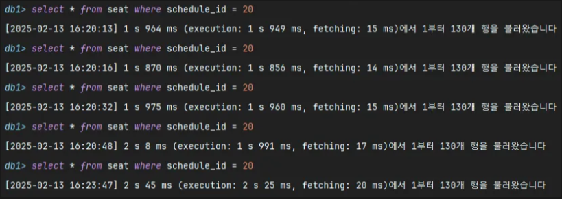
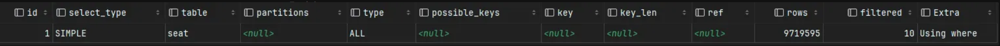
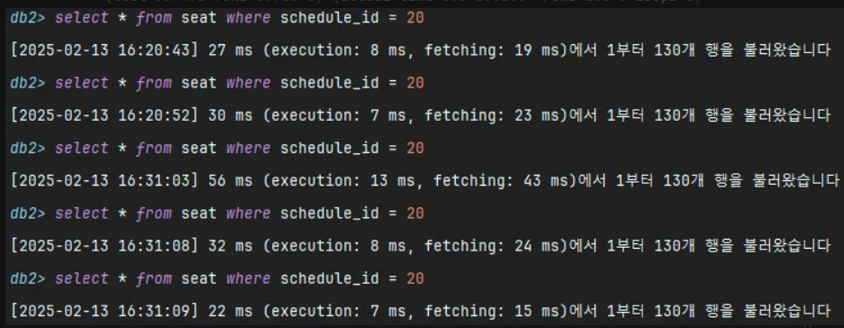
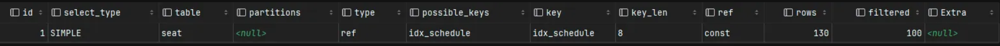
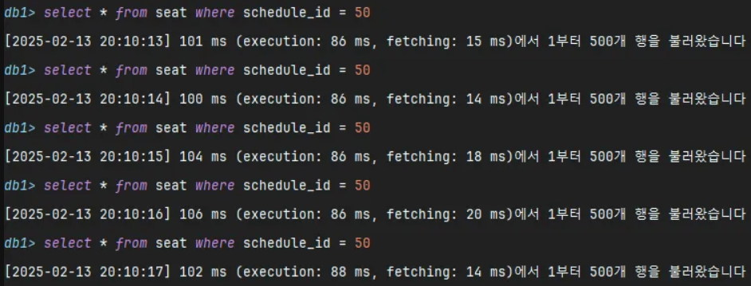
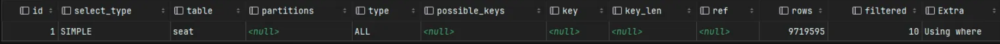
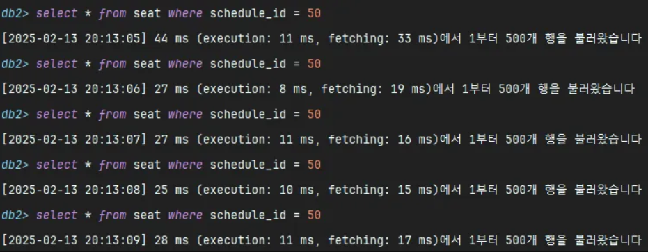
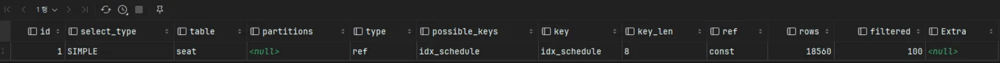

# 인덱싱 성능 테스트 

## 목차
* [인덱스 조사 내용](#인덱스)
  * [인덱스 적용 컬럼 기준](#인덱스-적용-컬럼-기준)
  * [조회 빈도와 응답 시간의 관계](#조회-빈도와-응답-시간의-관계)
* [인덱싱 성능 테스트](#프로젝트-주요-쿼리-인덱싱-성능-테스트)
  * [실행 쿼리](#1-스케줄-별-좌석-조회-쿼리)
  * [테스트 케이스](#2-테스트-케이스)
  * [테스트 결과 비교](#3-성능-테스트-결과-비교)

## 인덱스
- 검색 속도를 향상시키기 위해 사용하는 자료 구조.
- 특정 컬럼을 인덱스를 설정하면, 해당 컬럼의 값을 정렬하여 데이터를 적재하여 해당 컬럼으로 조회 시 성능 향상.
- 인덱스 또한 공간을 차지 하기 때문에 너무 많지 않은 인덱스를 설정해야 한다.
- 조회 성능을 높일 수 있지만 고려해야할 것이 많다.

| 상황                  | 적용 컬럼 |
|---------------------|----|
| 한 번에 찾을 수 있어야 하는 경우 | 데이터 중복이 적은 컬럼 |
| 인덱스 재정렬 최소화         | 데이터 삽입, 수정이 적은 컬럼 |
| 빠른 검색               | 검색 조건으로 자주 사용되는 컬럼 |

### 단일 인덱스
검색 패턴이 단일 컬럼 중심일 때 주로 사용된다.

- 특정 컬럼 값을 정렬된 형태로 저장.
- 해당 값이 위치한 실제 데이터 레코드의 주소를 가진다.
```
       (50)
      /    \
  (25)      (75)
  /  \      /  \
(10) (40) (60) (90)
```

### 복합 인덱스
두 개 이상의 컬럼을 조합해서 검색하는 경우가 많을 때 사용되며, order by, group by 최적화가 필요한 경우에도 사용된다.
- 두 개의 컬럼(name, age) 값을 생성하면 name, age 를 기준으로 정렬된다.
```
       ('철수', 30)
      /           \
  ('민지', 25)   ('성현', 40)
  /     \         /       \
('순재', 20) ('민영', 30) ('지수', 35) ('가영', 45)
```
- where name = ‘성현’ and age = 40 을 쿼리하면 name, age 순서대로 정렬되어있어 빠르게 탐색이 가능하다.
- 부분 인덱스도 활용 가능하기 때문에 where name = ‘성현’ 으로 쿼리해도 최적화가 가능하다.
- where age = 40 은 인덱스 활용이 안된다. name을 먼저 정렬했기 때문에, age만 단독 검색하면 풀스캔 가능성이 높다.
- 복합 인덱스 설정 시, 컬럼 순서가 중요하다.

## 인덱스 적용 컬럼 기준
높은 카디널리티 → 데이터의 중복이 적은 컬럼

왜?

데이터 중복이 많은 컬럼에 적용했다고 가정하자. → 낮은 카디널리티

중복된 값들이 많아 인덱스를 사용했을 때와 안했을 때의 차이가 거의 없을 수 있다.

- 인덱스 선택률이 낮아 성능 개선 효과가 적다.
    - 인덱스가 가리키는 레코드가 많아져 결국 테이블 풀스캔하는 것과 유사.
- 인덱스 트리의 크기 증가로 오버헤드 발생
    - 일반적으로 B-Tree 기반의 인덱스를 사용한다.
    - 데이터가 균형 있게 분포되어 있어야 유지되는데, 중복도가 높다면 값이 한쪽으로 몰리는 문제가 발생한다.
    - 이런 경우, 인덱스를 탐색하는 데 걸리는 시간이 늘어나고, 데이터 변경 시에도 불필요한 인덱스 유지비용이 증가할 수 있다.

인덱스를 통해 레코드 1건을 읽는 것이 테이블을 통해 직접 읽는 것보다 4 ~ 5배 정도 비싸다.

그럼에도 인덱스를 사용하는 이유는 뭘까.

DBMS는 우리가 원하는 레코드가 어디 있는지 모르므로, 모든 테이블을 뒤져서 레코드를 찾아야 한다.<br>
이는 엄청난 디스크 읽기 작업이 필요하므로 상당히 느리다.

인덱스를 사용하게 되면 인덱스를 통해 PK를 찾고, PK를통해 레코드를 저장된 위치에서 바로 가져올 수 있으므로 디스크 읽기가 줄어든다.

인덱스에 대한 어느정도의 비용이 들어도 없는 것보다 레코드를 찾는 속도가 훨씬 빠르기 때문에 인덱스를 사용한다.

반면 인덱스를 타지 않는 것이 효율적일 때도 있다.

읽어야 할 레코드의 건수가 전체 테이블 레코드의 20 ~ 25% 를 넘어서면 인덱스를 이용하지 않는 것이 효율적이다.<br>
이런 경우 옵티마이저는 인덱스를 이용하지 않고 테이블 전체를 읽어서 처리한다.

## **조회 빈도와 응답 시간의 관계**

- 조회 빈도가 높은 경우, 응답 속도가 중요해진다.
    - 같은 쿼리가 자주 실행되면, 응답 시간이 짧을수록 시스템 전체의 부하가 줄어듦.
    - 예를 들어, 1초에 100번 실행되는 쿼리가 50ms에서 5ms로 줄어든다면, 전체 부하를 크게 줄일 수 있을 것이다.
- 조회가 빈번하다고 반드시 인덱스를 적용해야 하는 것은 아니다.
    - 인덱스는 조회 성능을 향상시키지만, 데이터 쓰기 작업에는 오버헤드가 발생한다.
    - 쓰기 작업 시 B-Tree 재구성 등 추가적인 작업이 필요하다.
    - 테이블 대부분을 조회하는 경우에는 인덱스보다 테이블 풀스캔이 더 빠를 수 있다.

---

## 프로젝트 주요 쿼리 인덱싱 성능 테스트

- 자주 호출되는 쿼리
- 실행 시간이 길거나 리소스를 많이 사용하는 쿼리

빈번하게 호출되거나 서비스 성능에 영향을 줄 수 있다면 주요 쿼리라고 말할 수 있을 것 같다.<br>
현 프로젝트에서 조회 빈도가 가장 높은 쿼리는 스케줄 별 좌석 조회다.

### 1. 스케줄 별 좌석 조회 쿼리
```
-- 쿼리
select * from seat where schedule_id = ?

-- 인덱스 적용
create index idx_schedule_id on seat (schedule_id);
```
- 좌석 상태를 따로 관리하지 않아, 단일 인덱스를 적용했다.

### 2. 테스트 케이스

|       | 스케줄 개수  | 좌석 개수(스케줄당) | 총 좌석 개수 |
|-------|---|-------------|---------|
| 케이스 1 |10만 개   | 100개        | 1000만 개 |
|  케이스 2|1000개 | 1만 개        | 1000만개  | 


두 케이스 모두 총 좌석 개수가 10만 개로, B-Tree 깊이 차이는 크지 않지만<br>
스케줄 개수가 다르면 **인덱스 선택도**가 달라져, 조회 성능에 차이가 발생할 것으로 예상된다.

>  **인덱스 Selectivity(선택도)** : 고유한 값의 개수 / 전체 행 수
> - 선택도가 높을수록 **인덱스 검색 성능이 좋음**.
> - `schedule_id`의 등장 횟수가 많아질수록 **선택도가 낮아지고, 인덱스 필터링 효과가 떨어짐**.

### 2-1. 케이스 1
- `schedule_id`가 10만 개, 총 데이터 1000**만 개**
- `schedule_id`의 평균 등장 횟수 = **1000만 / 10만 = 100**
- 선택도 = `10만 / 1000만 = 0.01 (1%)`

**인덱스 적용 전**
- 일반 호출 : 평균 1 s 972 ms



- Explain



- Explain analyze
```
-> Filter: (seat.schedule_id = 20)  
(cost=997472 rows=971960) (actual time=0.875..2361 rows=130 loops=1)
-> Table scan on seat  
(cost=997472 rows=9.72e+6) (actual time=0.571..2004 rows=10e+6 loops=1)
```

**인덱스 적용 후**
- 일반 호출 : 평균 33 ms



- Explain



- Explain analyze
```
-> Index lookup on seat using idx_schedule (schedule_id=20)  
(cost=143 rows=130) (actual time=0.272..0.282 rows=130 loops=1)
```

### 2-2. 케이스 2
- `schedule_id`가 1000개, 총 데이터 **1000만 개**
- `schedule_id`의 평균 등장 횟수 = **1000만 / 1000 = 1만**
- 선택도 = `1000 / 1000만 = 0.0001 (0.01%)`

**인덱스 적용 전**
- 일반 호출 : 평균 102 ms



- Explain



- Explain analyze
```
-> Filter: (seat.schedule_id = 50)  
(cost=996550 rows=971960) (actual time=126..2539 rows=10000 loops=1)
-> Table scan on seat  
(cost=996550 rows=9.72e+6) (actual time=1.08..2163 rows=10e+6 loops=1)
```

**인덱스 적용 후**
- 일반 호출 : 평균 30 ms



- Explain



- Explain analyze
```
-> Index lookup on seat using idx_schedule (schedule_id=50)  
(cost=20393 rows=18560) (actual time=2.22..25.7 rows=10000 loops=1)
```

### 3. 성능 테스트 결과 비교

|              | 케이스 1 (스케줄 10만 개, 좌석 100개)  | 케이스 2 (스케줄 1000개, 좌석 1만 개) |
|--------------|-----------------------------|------------------------------------|
| 인덱스 적용 전 | 평균 1s 972ms | 평균 102ms |
| 인덱스 적용 후 | 평균 33ms **(약 98% 성능 ↑)** | 평균 30ms **(약 70% 성능 ↑)** |
| Explain(적용 전) | Table Scan 수행(cost=997472, rows=10M) | Table Scan 수행(cost=996550, rows=10M) |
| Explain(적용 후 ) | Index Lookup 수행(cost=143, rows=130) | Index Lookup 수행(cost=20393, rows=10,000) |
- 인덱스 적용 전에는 케이스 2가 더 빠름.
  - 테이블 스캔시 schedule_id 개수가 적어, schedule_id의 데이터를 빠르게 찾을 수 있음.
- 인덱스 적용 후에는 케이스 1이 더 효율적
  - 개별 schedule_id 의 row 수가 적어 index lookup 비용이 낮음.
  - 케이스 2는 가져올 row 수가 많아 인덱스 탐색 후 추가적인 비용이 발생.
- 케이스 2는 추가 최적화가 필요할 가능성 있음.
  - 인덱스 적용 후에도 개별 schedule_id에 대한 row 가 많아 커버링 인덱스, 파티셔닝, 샤딩 등 추가 최적화 고려 필요.

---

## 참고
- [인덱스](https://mangkyu.tistory.com/96)
- [인덱스 선택도](https://velog.io/@jduck1024/%EC%B9%B4%EB%94%94%EB%84%90%EB%A6%AC%ED%8B%B0-VS-%EC%84%A0%ED%83%9D%EB%8F%84-feat.-NDV-Density)
- [더미데이터 생성 스크립트](https://github.com/kimseonkyoung/hhplus-concert-reservation/wiki/etc.-%EB%8D%94%EB%AF%B8%EB%8D%B0%EC%9D%B4%ED%84%B0-%EC%83%9D%EC%84%B1-%EC%8A%A4%ED%8A%B8%EB%A6%BD%ED%8A%B8(%ED%94%84%EB%A1%9C%EC%8B%9C%EC%A0%80,-CSV-Load-Data-Infile))