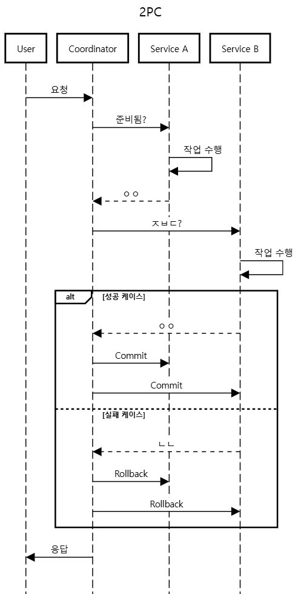
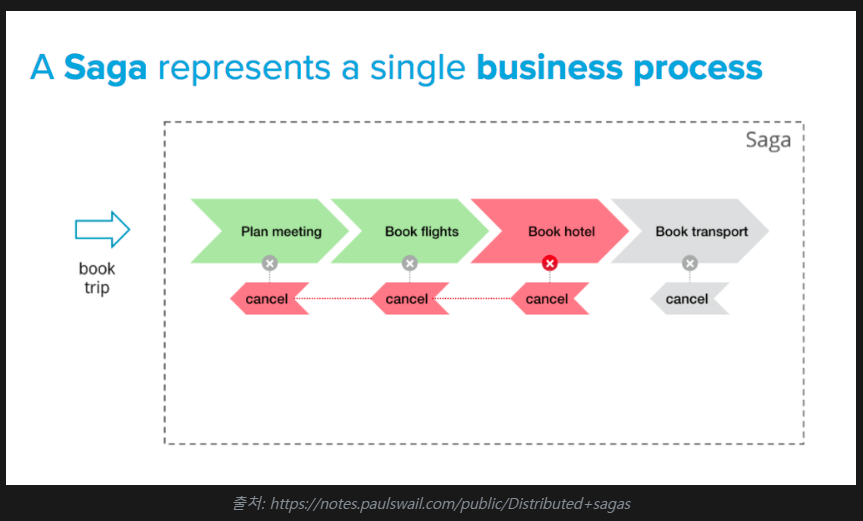
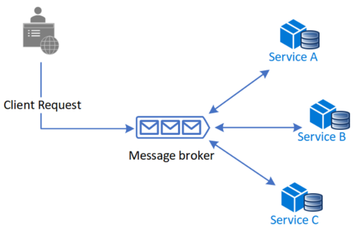
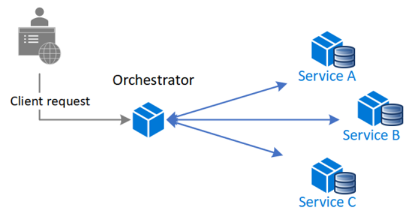

# 도메인 분리에 따른 트랜잭션 처리 한계와 해결방안

## 목차

---
* [기존 서비스 트랜잭션 관리 방식](#기존-서비스-트랜잭션-관리-방식)
* [도메인 분리 시 트랜잭션 처리 한계](#도메인-분리-시-트랜잭션-처리-한계)
* [분산 트랜잭션 관리 전략](#분산-트랜잭션-관리-전략)
* [결론](#결론)

## 기존 서비스 트랜잭션 관리 방식

---
### 결제
```
결제_TX () {
    예약_조회();
    예약_상태_수정();
    유저_포인트_차감();
    토큰_만료_처리();
    결제_생성();
}
```
- 위의 로직은 하나의 트랜잭션으로 묶여있어, 작업 일부가 실패하면 전체 작업을 롤백한다.
- 데이터 일관성을 쉽게 맞출 수 있지만, 특정 작업의 처리가 지연된다면 전체 트랜잭션 처리 시간에 영향을 준다.
- 토큰 만료 처리는 필요한 작업이지만 결제 로직에 포함될 필요는 없다.
  - 토큰 만료 처리 실패는 결제 실패로 이어지기 때문에 사용자 경험이 좋지 않다.

### 좌석 예약
```
@분산락
좌석_예약_TX () {
    사용자/콘서트_정보_조회();
    예약된_좌석인지_검증();
    임시_예약_생성();

    데이터_플랫폼_전송();
}
```
- 좌석 예약의 경우, 좌석 예약 정보를 데이터 플랫폼에 전송하는 요구 사항이 추가됐다.
- 데이터 플랫폼 전송 처리 시간이 지연될수록 트랜잭션 처리 시간도 늘어난다.
- 그만큼 DB 커넥션을 점유하게 되고 락을 사용하는 경우, 다른 요청의 대기 또는 데드락이 발생할 수 있다.
- 결제 로직과 마찬가지로, 다른 도메인 작업에 대한 분리가 필요하다.

두 기능 모두 공통적인 문제점이 있다.
- 다른 도메인 작업에 의한 트랜잭션 처리 시간 ↑
- 관심사 분리 X

다른 도메인에서 수행되는 작업들이 주 도메인에 영향을 주지 않으려면 어떻게 해야 할까.<br>
결제, 예약을 생성하기 위해 필요한 정보가 있기 때문에 모든 도메인을 분리하기엔 무리가 있다.<br>
원자적으로 실행되어야 할 작업은 트랜잭션을 유지하고, 당장 수행하지 않아도 될 작업은 비동기 이벤트로 처리해볼 수 있을 것 같다.

### TO-BE
```
결제_TX () {
    예약_조회();
    예약_상태_수정();
    유저_포인트_차감();
    결제_생성();
    
    결제_완료_이벤트_발행(); // 토큰 만료 처리
}
```
```
좌석_예약_TX () {
    사용자/콘서트_정보_조회();
    예약된_좌석인지_검증();
    임시_예약_생성();

    예약_완료_이벤트_발행(); // 데이터 플랫폼 전송
}
```

## 도메인 분리 시 트랜잭션 처리 한계

---

이벤트 처리를 통해 어느정도 관심사를 분리했다. 하지만 이벤트로 발행한 작업이 실패하면 어떤 문제 발생할까.

결제는 완료되었지만 토큰 만료 처리가 되지 않아, 해당 토큰이 만료될 때까지 다른 사용자는 대기 상태에 있어야 한다.<br>
결국 데이터 일관성이 유지되지 않을 수 있다.

더 나아가, 도메인이 MSA 형태로 분리 된다면 데이터 일관성을 어떻게 보장할 수 있을까.

## 분산 트랜잭션 관리 전략

- 2PC (2-Phase-Commit)
- SAGA 패턴
- Outbox 패턴

### 2PC

코디네이터가 트랜잭션을 조정하며, 참여자(노드)들이 트랜잭션을 수행하는 구조
- Prepare 단계 : 트랜잭션에 참여 하는 모든 DB가 커밋 가능한 상태 또는 불가능한 상태를 코디네이터에게 알린다.
- Commit 단계 : 코디네이터가 커밋 또는 롤백 수행



- 장점
  - 원자성 보장 : 여러 서비스에 걸쳐 있는 트랜잭션도 하나의 트랜잭션처럼 다룰 수 있다.
  - DB 수준에서 ACID가 보장되므로 개발자가 트랜잭션을 직접 관리하지 않아도 된다.
- 단점
  - 성능 저하 : 모든 참여자가 응답해야 하기 때문에 지연이 크다.
  - 단일 장애점(SPOF) : 코디네이터에 의존적이기 때문에 장애 발생 시 전체 트랜잭션이 실패할 수 있다.
  - 모든 트랜잭션이 DBMS 내부에서 처리되므로, 특정 DBMS에 종속될 수 있다.
    - No-SQL은 2PC-분산-트랜잭션을 지원하지 않는다. 

### SAGA 패턴



- 여러 개의 로컬 트랜잭션으로 나누고, 각 트랜잭션이 독립적으로 실행된다.
- 개별 서비스가 실패했을 때, 보상 트랜잭션이 발생하여 이전에 실행되었던 트랜젹션을 롤백시킨다.
- 보상 트랜잭션이 적용되기 전까지 일시적으로 데이터 정합이 깨져있을 수 있으나, 보상 트랜잭션이 완료되면 '결과적 일관성'을 보장한다.
- 2PC와 달리 애플리케이션에서 트랜잭션 흐름을 제어하는 방식으로, 데이터 일관성은 떨어질 수 있지만 성능과 확장 측면에서 이점이 있다.

### 장점
- 비동기 처리를 통한 성능 향상
- 트랜잭션이 독립적으로 실행되며, 한 서비스가 느려도 전체 트랜잭션에 영향을 받지 않음.

### 단점
- 데이터 일관성 보장 어렵고, 보상 트랜잭션이 필수적이다.

### 1. Choreography Based Saga
- 각 서비스가 직접 이벤트를 주고 받으며 트랜잭션을 수행하는 방식.
- 중앙에서 조율하는 코디네이터 없이, 서비스 간 이벤트 기반으로 동작.



**프로세스**
- 클라이언트 요청을 받은 서비스 A 가 트랜잭션 수행 후 완료 이벤트 발생.
- 다음에 수행되어야할 트랜잭션이 있다면, 해당 이벤트를 구독한 서비스가 이어서 실행.
- 중간에 트랜잭션이 실패하면, 보상 트랜잭션 이벤트 발생.
  - 다른 서비스들이 해당 이벤트를 받아 보상 트랜잭션 실행.

### 2. Orchestration Based Saga
- 중앙 오케스트레이터가 각 서비스들의 트랜잭션을 관리한다.
- 중앙에서 트랜잭션을 관리하기 때문에 프로세스 흐름이 명확하다. 



**프로세스**
- 클라이언트 요청을 받으면, SAGA Orchestrator가 트랜잭션 시작.
- 첫 번째 서비스에게 작업 수행 요청. 성공하면 두 번째 서비스에게 요청 -> 연쇄적으로 진행
- 특정 지점에서 트랜잭션 실패 시, 중앙에서 보상 트랜잭션을 실행하여 롤백.

## 결론
모놀리식 구조에서 분산 트랜잭션 구현 시, 데이터 정합성이 중요하다면 2PC를 적용해볼 수 있을 것 같다.

MSA 환경을 고려한다면 SAGA 패턴을 적용하는 것이 성능과 확장성에 이점이 있다.<br>
그렇다면 현 프로젝트에서 Choreography 와 Orchestration 중 어떤 방식이 더 적합할까?

### ❌ Orchestration
- saga 참가자(Service)가 많은 경우
  - 중앙에서 명확하게 트랜잭션을 제어할 필요가 있음.
- 에러 핸들링이 복잡한 경우
  - 예약 취소, 환불, 좌석 재할당 등 예외 처리가 많다면 오케스트레이션 방식이 더 적합할 수 있다.

### ✅ Choreography
- 서비스 간의 상호작용이 단순하고 이벤트 흐름이 명확한 경우
  - 좌석 예약 과정이 몇 단계로 고정되어 있고, 서비스 간 호출 순서가 직관적인 경우 적합.
- 서비스 간 결합도를 낮추고 싶은 경우
  - 각 서비스들이 이벤트를 발행하고 구독하는 형태이기 때문에 직접적인 의존성이 낮다.
  
확장성에 유리한 Choreography 방식이 적합할 것 같다.

이벤트 기반 비동기 처리로 인해 서비스 간 결합도가 낮고, 개별 서비스들이 독립적으로 확장 가능하다.
- 새로운 서비스 추가 용이 -> 이벤트 구독만 추가
- 대량 트래픽을 병렬로 처리 가능 -> 이벤트 큐 기반으로 분산 처리 (MQ,Kafka)
- 코디네이터가 없어 병목 발생 X

## 참고
- [SAGA는 트랜잭션이 격리되지 않는다.](https://hudi.blog/saga-pattern/#SAGA%EB%8A%94-%ED%8A%B8%EB%9E%9C%EC%9E%AD%EC%85%98%EC%9D%B4-%EA%B2%A9%EB%A6%AC%EB%90%98%EC%A7%80-%EC%95%8A%EB%8A%94%EB%8B%A4)
- [MSA-환경에서의-분산-트랜잭션-관리2PC-SAGA-패턴](https://velog.io/@ch200203/MSA-%ED%99%98%EA%B2%BD%EC%97%90%EC%84%9C%EC%9D%98-%EB%B6%84%EC%82%B0-%ED%8A%B8%EB%9E%9C%EC%9E%AD%EC%85%98-%EA%B4%80%EB%A6%AC2PC-SAGA-%ED%8C%A8%ED%84%B4)
- [design-pattern-saga](https://yearnlune.github.io/general/design-pattern-saga/#)